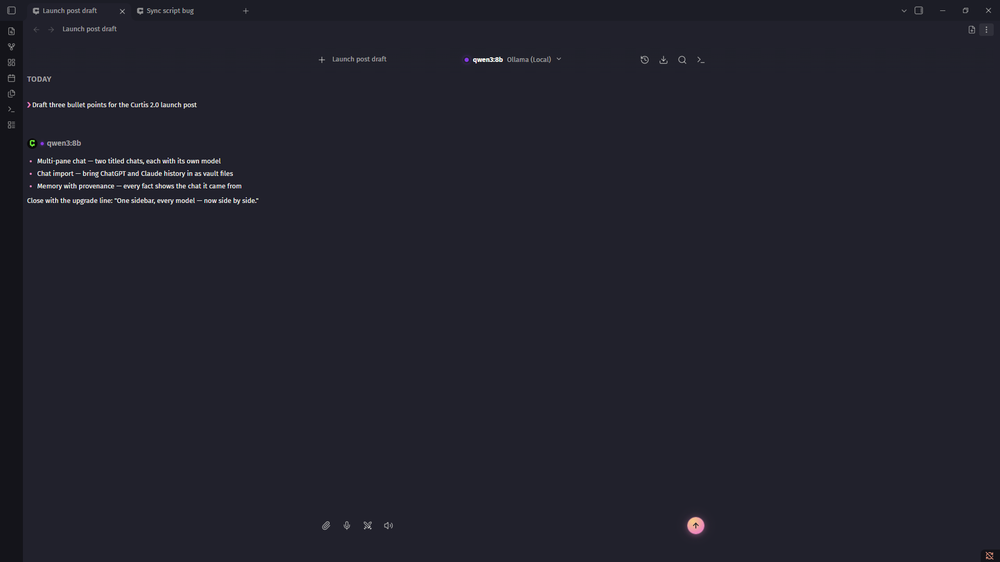
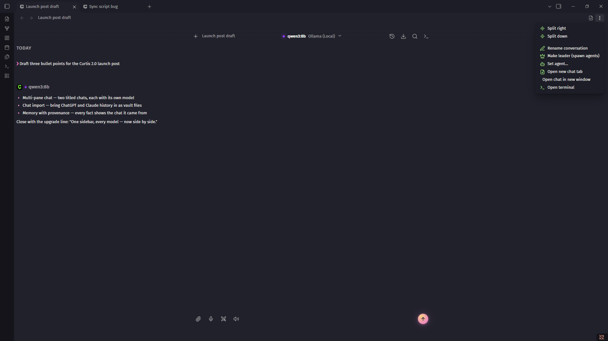

# Multi-pane chat

> Two chats at once. Each pane picks its own model.

Open another chat as a tab beside the active one, or pop one out into its own OS window. Every pane is a full, independent chat with its own conversation, provider, and model.

## Opening another chat

- The **new-tab icon** on the pane header — always visible, one click to a second chat
- Command palette → **Open new chat tab** (a full-width tab beside the active one) or **Open chat in new window** (a separate OS window)
- The **popout icon** on the chat pane header — carries that pane's conversation into the window
- The pane's **"..." menu** — new tab, this chat in a window, rename

A new tab — or a pane split — starts a **fresh conversation**, not a second view of the current chat — a second view of a thread is what the history dropdown is for.

## Telling panes apart

Tabs and windows are titled with their conversation. Fresh chats are numbered while untitled — "New chat 2", "New chat 3" — so several new panes never share a label; the first message titles the chat and the number goes away. The same title sits quietly in the chat header; clicking it renames — as does the pane menu's **Rename conversation**. Renaming retitles the vault file too (`/title` does the same from the input box).

## What each pane keeps

- **Conversation** — panes never share a thread. The history dropdown in a pane switches that pane's conversation only.
- **Provider and model** — pick differently per pane. Switching models in one pane never touches another.

Plugin-wide state stays shared: settings, the memory file, the vault index, and provider keys.

## Panes vs the arena

Both put two models in view; they answer different questions:

- The [arena](ARENA.md) sends **one prompt to 2–4 models** and you promote a winner — single-shot comparison.
- Panes are **two ongoing chats** — keep drafting with one model while interrogating a doc with another, each with its own full history.

## Use cases

**Two providers, same task**

> Draft against Claude in one tab, GPT in the other. Continue each thread on its own terms — no promote step, no losing column.

**Long-running agent + a quick chat**

> Leave the agent working through a vault task in one pane; keep a fast conversation going in the other without cancelling anything.

**Reference and draft**

> One pane interrogating a source note, one pane writing. Mentions and retrieval work per pane.

## Mobile

Tabs work on mobile, though one chat at a time is the norm on a phone. Popout windows are desktop-only.

## See also

→ [ARENA.md](ARENA.md) for single-prompt parallel comparison
→ [PROVIDERS.md](PROVIDERS.md) for the provider list
